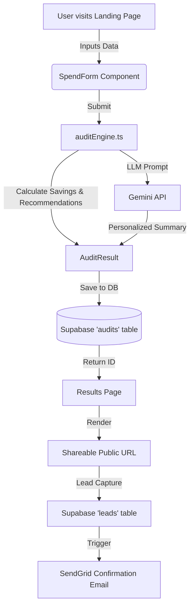

# System Architecture

## Data Flow

## Stack Choices

- **Frontend**: Next.js 14 (App Router), React, Tailwind CSS
  - *Why*: App Router provides excellent server-side rendering and simple API route creation out of the box. Tailwind allows for rapid prototyping of the sleek UI required for high-conversion landing pages.
- **Backend & Database**: Next.js Route Handlers + Supabase (PostgreSQL)
  - *Why*: We need a simple, reliable way to store JSON (the audit result) and relational data (leads). Supabase gives us instant PostgreSQL with a clean TypeScript SDK.
- **AI Integration**: Google Gemini API
  - *Why*: Gemini 1.5 Flash provides fast, low-latency text generation which is perfect for generating a <100 word summary block without keeping the user waiting for seconds.
- **Email**: SendGrid
  - *Why*: Easy transactional email API with high deliverability.

## Scaling to 10k audits/day

If this tool had to handle 10,000 audits per day (~7 audits/minute):
1. **Edge Caching**: I would move the pricing data and static assets to an Edge CDN to minimize server load.
2. **Database Connection Pooling**: Direct Supabase queries in API routes would exhaust connection limits. I would implement PgBouncer or Supabase's built-in connection pooling.
3. **Async AI Generation**: Right now, the Gemini API is called synchronously during the audit calculation. For 10k users, rate limits would hit fast. I would push the summary generation to a background queue (e.g., Inngest or Upstash Kafka) and use Server-Sent Events (SSE) or WebSockets to stream the summary back to the client once it's ready.
4. **Rate Limiting**: I would add Upstash Redis for IP-based rate limiting to prevent abuse and bot spam on the lead capture form.
